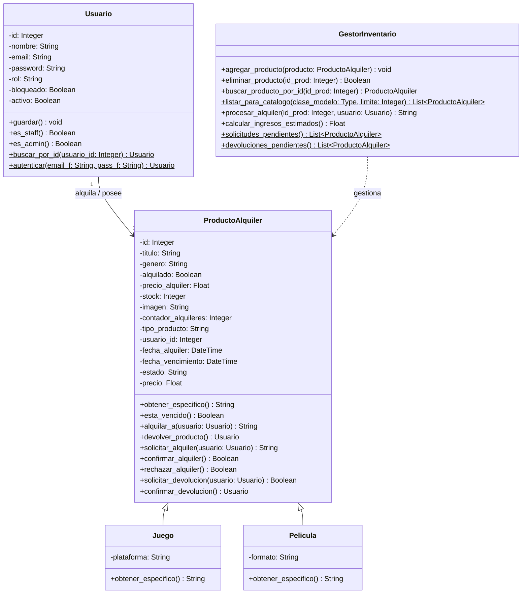

# 🎬🎮 Sistema de Gestión de Alquiler de Peliculas y Juegos

## 🚀 Objetivo del Proyecto
Este proyecto es una aplicación web desarrollada mediante **Flask** con el fin de desarrollar un sistema de software orientado a objetos que automatice la administración, alquiler y devolución de un catálogo de productos, brindandole a los administradores herramientas de  control de usuarios, y a los clientes un sistema de reservas eficiente.

## 🛠️ Componentes y Tecnologías
* **Backend:** Python 3.x con el microframework **Flask**.
* **Base de Datos:** SQLite. 
* **Frontend:** Plantillas dinámicas (HTML/CSS) 

## 📦 Estructura del Proyecto
```text
├── static/             # Archivos estáticos (CSS, imágenes)
├── templates/          # Plantillas HTML renderizadas por Flask
├── alquileres.db       # Base de datos SQLite del sistema
├── app.py              # Servidor principal y rutas de Flask
├── README.md           # Documentación del proyecto
└── requirements.txt    # Dependencias y librerías del proyecto
```


## 🗺️ Diagrama de Clases (UML)



## 🤝 Relaciones entre Clases

| Clase Origen | Relación | Clase Destino | Descripción |
|-------------|-----------|---------------|-------------|
| Usuario | Asociación (1 → 0..*) | ProductoAlquiler | Un usuario puede alquilar 0 o varios productos. |
| GestorInventario | Dependencia | ProductoAlquiler | Gestiona altas, bajas, búsquedas y alquileres de productos. |
| Juego | Herencia | ProductoAlquiler | Juego es un tipo específico de producto de alquiler. |
| Pelicula | Herencia | ProductoAlquiler | Película es un tipo específico de producto de alquiler. |

